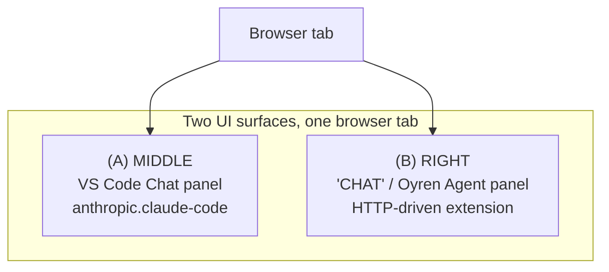
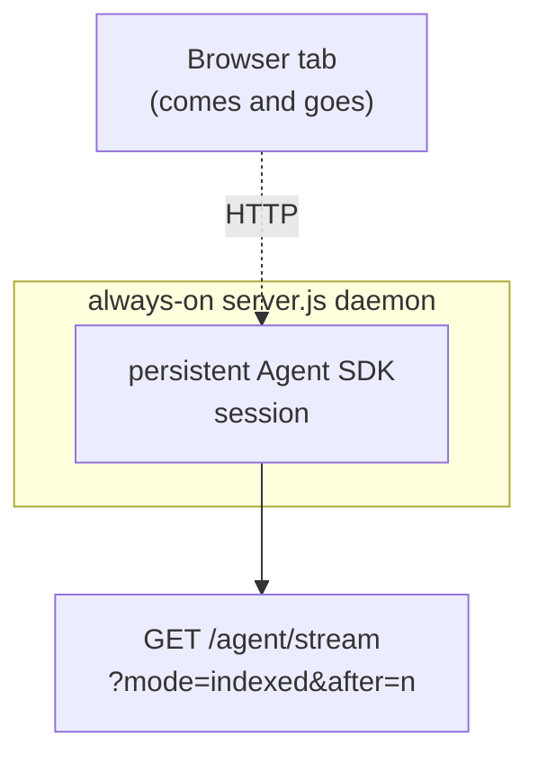
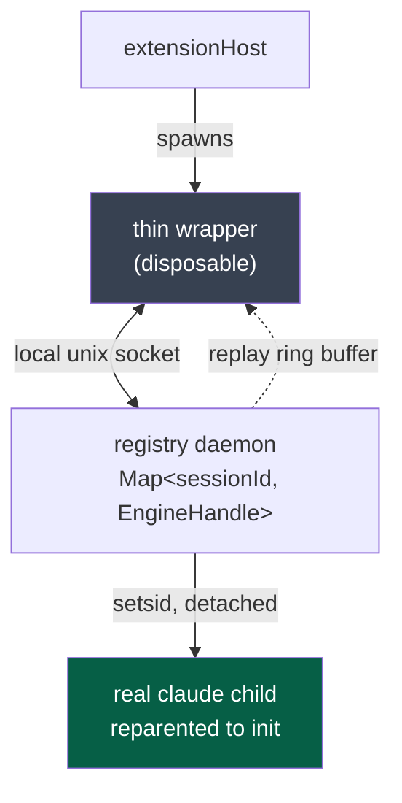
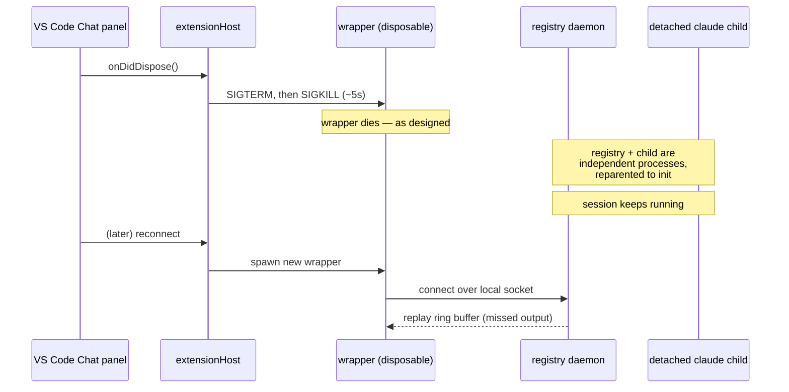
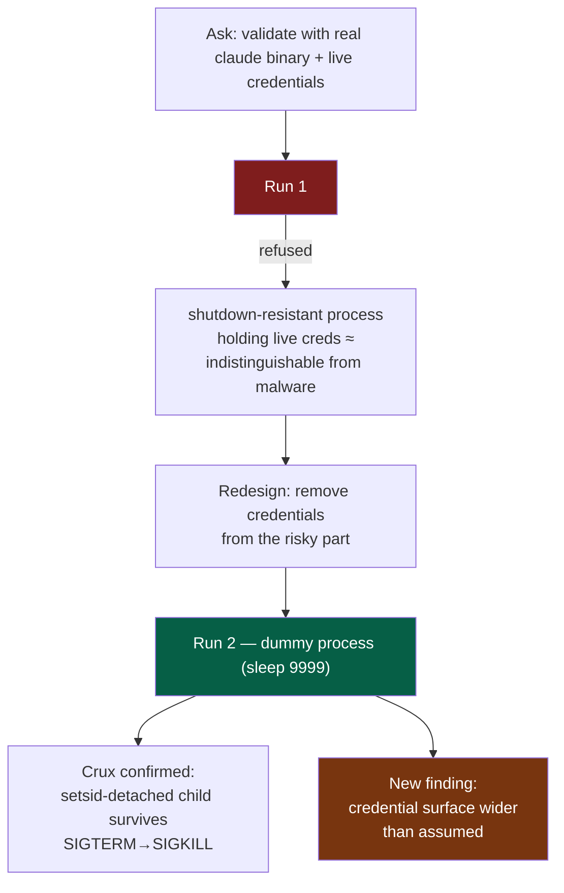
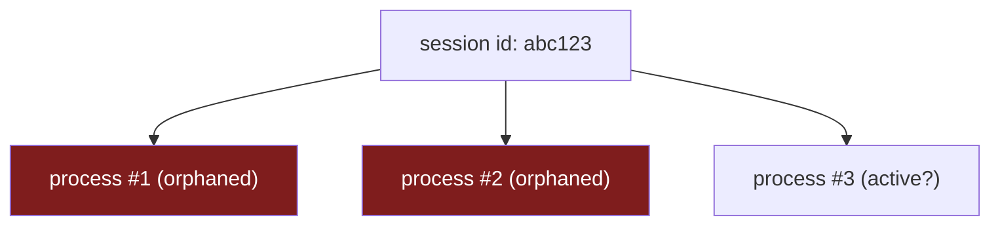
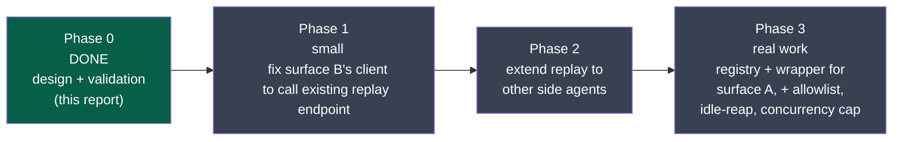

# Continuity Design
## Surviving a Closed Laptop

Design + empirical validation report

<div class="pt-8 opacity-70 text-sm">
Status: mechanism empirically validated · nothing implemented yet
</div>

---
layout: default
---

# Agenda

<Toc minDepth="1" maxDepth="1" />

---
layout: two-cols
layoutClass: gap-8
---

# The Problem

Oyren runs cloud dev servers — full servers, not "containers" — reached via
browser, embedding **openvscode-server** (the VS Code Remote fork).

Users talk to a coding agent through **two UI surfaces at once**:

- **(A) MIDDLE** — main editor tab, native VS Code Chat panel, powered by
  Anthropic's closed-source `anthropic.claude-code` extension
- **(B) RIGHT** — sidebar "CHAT" / "Oyren Agent" panel, a separate
  HTTP-driven extension driving multiple CLI agents

::right::

<div class="mt-12"/>



<div class="mt-8 text-red-500 font-bold text-lg">
Today: closing the browser kills surface (A) mid-task —
even while it's actively running tools.
</div>

---

# Root Cause — Surface A

The process chain, and where the kill signal actually comes from:

```mermaid
flowchart LR
  systemd["systemd"] --> super["openvscode-server
  supervisor"]
  super --> main["server-main.js"]
  main --> host["extensionHost"]
  host -->|"direct child process"| claude["`claude` binary"]

  style claude fill:#7f1d1d,color:#fff
```

<div class="grid grid-cols-2 gap-6 mt-8">
<div>

**The trigger**

Extension code registers:

```ts
onDidDispose(() => s.shutdown())
```

Panel disposal &rarr; `SIGTERM`, then `SIGKILL` ~5s later, sent straight to
the `claude` child.

</div>
<div>

**What's surprising**

VS Code Remote normally **tolerates disconnects for 3 hours** — a plain
network drop shouldn't do this.

The panel **disposing eagerly** is the real trigger. Exact cause not fully
pinned down — but the fix doesn't need to know why.

</div>
</div>

---
layout: center
---

# The Surface-B Surprise
### (good news)

---

# Surface B Is Different

Initial assumption: per-turn `claude -p` invocations. **Wrong.**

<div class="grid grid-cols-2 gap-8 mt-8">
<div>

**What it actually is**

- **ONE persistent Claude Agent SDK session**, alive for the server's whole
  life
- Runs inside an always-on `server.js` daemon
- **Decoupled from any browser connection**
- Already survives disconnects mid-turn — **by construction**

</div>
<div>



</div>
</div>

<div class="mt-10 p-4 rounded bg-green-900 bg-opacity-30 border border-green-700">

**Only real gap:** the client never calls the existing reconnect/replay
endpoint (`GET /agent/stream?mode=indexed&after=<n>`).

A small client-side fix — **not new infrastructure.**

</div>

---
layout: center
---

# The Fix — Surface A

---

# The Fix — Surface A

A real, machine-scoped VS Code setting:

```
claudeCode.claudeProcessWrapper
```

redirects the extension's **entire process spawn** to a wrapper — passing the
real binary's full `argv` through unchanged. **No patching the closed-source
extension needed.**

<div class="grid grid-cols-2 gap-6 mt-6 text-sm">
<div>

**Design**

1. Thin wrapper connects over a **local unix socket** (same-server only,
   never network-exposed) to a registry daemon
2. Registry generalizes the same always-on `server.js` from surface B into
   `Map<sessionId, EngineHandle>`
3. One real, **detached** `claude` child process per session id
4. Registry starts a new `setsid`-detached process, or reconnects to an
   existing one
5. On reconnect: replay a ring buffer of missed output — **reusing surface
   B's proven mechanism**
6. The extension's kill only ever hits the **disposable wrapper**

</div>
<div>



</div>
</div>

---

# The Fix — Why the Kill Stops Mattering



---
layout: center
---

# Empirical Validation
### Tested, not theoretical — two isolated runs, each its own throwaway server

---

# Run 1 — Refused (Correctly)

<div class="mt-4">

**Ask:** validate using the real `claude` binary, with live credentials, in a
detached process.

**Response: refused.**

</div>

<div class="mt-8 p-5 rounded bg-red-900 bg-opacity-25 border border-red-700">

Correctly identified that "process survives its owning UI closing, holds
live credentials, and is decoupled from its kill signal" is
**indistinguishable from shutdown-resistant malware behavior** — given no
context that this was owner-requested continuity with a real backstop.

</div>

<div class="mt-6 font-bold">
Right call. It reshaped Run 2.
</div>

---

# Run 2 — Succeeded (Redesigned)

**Crux test redesigned around a dummy process** (`sleep 9999`) instead of the
real `claude` binary — removing live credentials from the risky part.

<div class="grid grid-cols-2 gap-6 mt-6">
<div>

### Results — all evidence-backed

- ✅ Wrapper redirection confirmed **end-to-end**: real
  headless-browser-triggered launch, screenshot-verified working panel,
  argv matched static analysis exactly
- ✅ **Crux question** — does a `setsid`-detached child survive
  SIGTERM-then-SIGKILL of its parent (the exact extension signal sequence)?
  **YES, definitively** — reparented to PID 1, kept running

</div>
<div>

- ✅ `CLAUDE_CODE_EXECPATH` confirmed **NOT** read by the extension at all —
  `claudeCode.claudeProcessWrapper` is the real, only redirect point
- ⚠️ **New finding:** live credential surface is much wider than assumed —
  GitHub tokens, other agents' API keys, MCP bearer tokens, session/control
  secrets — **not just Anthropic's own token**

</div>
</div>

<div class="mt-8 p-4 rounded bg-blue-900 bg-opacity-25 border border-blue-700 text-sm">
Validator redacted values, shredded its own log, and fully reverted its
throwaway server.
</div>

---

# The Two-Run Story



<div class="mt-6 text-center opacity-80">
The refusal wasn't a dead end — it was the mechanism that produced a safer,
still-conclusive test.
</div>

---

# Safety Requirements
### Forced in by the Run-2 findings — not optional

<div class="grid grid-cols-2 gap-x-8 gap-y-3 mt-6 text-sm">
<div class="p-3 rounded bg-gray-800 bg-opacity-40">

**Explicit env ALLOWLIST**
Not blind passthrough into the detached child.

</div>
<div class="p-3 rounded bg-gray-800 bg-opacity-40">

**LOCAL-ONLY socket**
Never network-exposed.

</div>
<div class="p-3 rounded bg-gray-800 bg-opacity-40">

**No secrets in argv**
Already confirmed true — `ps` exposes argv to other users, unlike env.

</div>
<div class="p-3 rounded bg-gray-800 bg-opacity-40">

**No persisted plaintext secrets**
Shred anything transient (as the validator itself did).

</div>
<div class="p-3 rounded bg-gray-800 bg-opacity-40">

**Explicit "stop for real" action**
Separate from disconnect-survival.

</div>
<div class="p-3 rounded bg-gray-800 bg-opacity-40 border border-red-600">

**Hard backstop**
Destroying the server always kills everything, regardless of detachment.

</div>
</div>

<div class="mt-8 text-center font-bold text-lg">
This design survives incidental disconnects only — never the owner's real
stop intent.
</div>

---

# Multiple Chats / Tabs

<div class="grid grid-cols-2 gap-8">
<div>

**Unchanged today**

Each new chat gets its own session id. Registry is keyed by session id —
distinct chats remain distinct entries.

**What the registry fixes**

Reconnecting to the **same** chat currently spawns duplicates.

<div class="mt-4 p-3 rounded bg-red-900 bg-opacity-25 border border-red-700 text-sm">
Confirmed live bug: <b>3 concurrent processes</b> found for one session,
none reaped.
</div>

</div>
<div>



<div class="mt-4 text-sm opacity-80">
Today: reconnect &rarr; no dedup &rarr; leak.
<br/>
Registry: reconnect &rarr; look up <code>sessionId</code> in the map &rarr;
reuse the existing <code>EngineHandle</code>.
</div>

</div>
</div>

<div class="mt-8 p-4 rounded bg-yellow-900 bg-opacity-25 border border-yellow-700">
<b>Open product decision:</b> second tab on the same session &rarr;
read-only viewer, last-writer-wins, or keep defaulting to distinct sessions?
</div>

---

# Status & Phases

<div class="mt-4">



</div>

<div class="mt-6 text-center font-bold">
Mechanism EMPIRICALLY VALIDATED. NOTHING IMPLEMENTED YET.
</div>

---

# Open Questions
### Listed, not resolved

<div class="mt-6 space-y-4 text-base">

1. **Multi-tab-same-session policy** — read-only viewer? last-writer-wins?
   keep distinct sessions?
2. **Disconnect-duration SLA** — sizes the replay ring buffer
3. **Risk tolerance** for depending on an undocumented Anthropic setting
   (`claudeCode.claudeProcessWrapper`)
4. **Concrete idle-reap / concurrency-cap numbers** — needs real capacity
   data
5. **Reconnect UX** — silent merge vs. explicit "you were away" marker

</div>

---
layout: center
class: text-center
---

# Closing Summary

<div class="text-left max-w-2xl mx-auto mt-6 space-y-3 text-base">

- Surface A closes the browser &rarr; kills the agent process mid-task, via
  the extension's own `onDidDispose` shutdown handler
- Surface B already gets continuity right — persistent daemon session,
  disconnect-tolerant by construction, just needs its client to call the
  replay endpoint it already has
- The surface-A fix reuses surface B's proven mechanism: a wrapper +
  registry + detached child, kill only ever hits the disposable wrapper
- **Empirically validated**, including the crux SIGTERM→SIGKILL survival
  test — via a redesigned, credential-free run after a first run correctly
  refused the risky version
- Validation surfaced its own safety requirements: allowlist, local-only
  socket, no persisted secrets, explicit stop-for-real, hard backstop
- **Status: design validated, nothing built yet** — phased rollout starting
  with the small surface-B client fix

</div>
