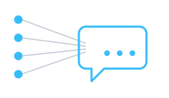

## One chat, every CLI agent

This is the **right-sidebar Chat panel** — labeled **Beta** — wired to the **agent your session
launched**: opencode, cursor, codex, claude, gemini, qwen or antigravity. Type plainly; no `@`
needed.

The **agent-type picker** (the monitor icon under the input) can open a chat for *any* of the seven
on the same files. Each agent keeps its own conversation — transcripts don't transfer between
engines, and an agent you haven't signed into will say so instead of pretending.

Prefer a terminal? The same agent is one keystroke away — see the next step.
