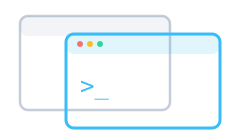

## Two screens, one terminal

The other way to reach an agent: the terminal. The default profile attaches to the same **tmux
session** the Oyren app's Terminal pane shows — the same agent the right-sidebar Chat panel
(**Beta**) talks to, one conversation on two screens. Closing a tab only detaches; the agent keeps
running.

The profile dropdown (the `+` split button) also starts any other agent CLI, or a plain `bash` when
you just want a shell.
